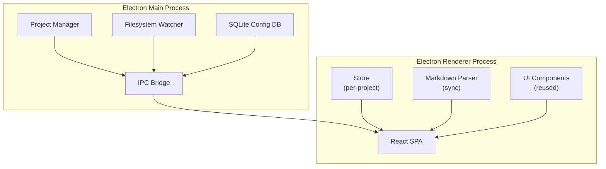

# Architecture Decision Document

_This document builds collaboratively through step-by-step discovery. Sections are appended as we work through each architectural decision together._

## Project Context Analysis

### Requirements Overview

**Functional Requirements:**

| Категория | FRs | Архитектурное значение |
|-----------|-----|------------------------|
| Desktop Shell | FR-1, FR-2, FR-3 | Замена Next.js App Router на Electron renderer process; React SPA вместо SSR |
| Multi-Project + SQLite | FR-4, FR-5, FR-6 | Новый слой хранения; per-project store isolation; IPC между main/renderer |
| Auto Filesystem Sync | FR-7, FR-8 | fs.watch + polling fallback; debounce/throttle для re-parse |
| Edit Verification | FR-9, FR-10 | CRUD verification suite; warning dialog для manual edits |
| Dark Theme + Win11 | FR-11, FR-12 | Theme tokens через Tailwind custom properties; audit hardcoded colors |
| Distribution | FR-13 | electron-builder; GitHub Releases auto-update |

**Non-Functional Requirements:**

- **NFR-1:** Startup < 5 секунд — влияет на lazy loading, code splitting
- **NFR-2:** Filesystem watcher не должен crash при удалении директорий — error boundary, graceful degradation
- **NFR-3:** Cross-platform (Win 10/11 x64, macOS 12+ x64+ARM, Ubuntu 22.04+, Fedora 38+) — native module prebuilds
- **NFR-4:** User-scoped data directories, no network access for core — security boundary

**Scale & Complexity:**

- Primary domain: Full-stack desktop (Electron main + renderer + SQLite + filesystem)
- Complexity level: **Medium-High** — миграция существующего приложения + новые подсистемы
- Estimated architectural components: **8-10** (Electron main, renderer SPA, SQLite layer, sync engine, store, IPC bridge, theme system, update manager, config manager)

### Technical Constraints & Dependencies

1. **Electron ^33** — выбран вместо Tauri из-за объёма существующего React-кода
2. **SQLite** — native module; требует prebuild binaries для всех платформ; fallback на JSON если сборка fails
3. **fs.watch** — ненадёжен на macOS (FSEvents) и network drives; нужен polling fallback на 30s
4. **gray-matter** — уже требует `serverComponentsExternalPackages`; в Electron не будет Next.js server components
5. **MIT License** — все зависимости должны быть совместимы
6. **Zero cost infrastructure** — GitHub Releases для обновлений

### Cross-Cutting Concerns Identified

1. **Theme System:** Все компоненты с hardcoded colors требуют audit; Tailwind custom properties для theme tokens
2. **Store Isolation:** Текущий `globalThis.__store` singleton должен стать per-project
3. **IPC Communication:** Все API routes (`/api/*`) нужно заменить на IPC handlers или embedded server
4. **Filesystem Watcher:** Error handling, retry logic, graceful shutdown — влияет на стабильность всей системы
5. **Cross-Platform Build:** Prebuild binaries, platform-specific paths, installer configuration
6. **Testing Strategy:** Unit (store, parser, watcher) + Integration (IPC, SQLite, sync) + E2E (UJ-1 through UJ-4) + Visual regression
7. **Theme Token System:** CSS custom properties on `:root` / `:root.dark` — replaces all hardcoded `jira-*` colors and `dark:` prefix duplication. Full light + dark token pairs defined in DESIGN.md.
8. **Icon System:** Lucide (stroke-based, outline, 1.5px stroke, 18px default). Replaces `@heroicons/react` and all emoji decorators. Hard rule: zero emoji-as-icons.
9. **Code Highlighting:** Catppuccin Mocha (dark) / Catppuccin Latte (light) via Shiki or highlight.js. Replaces `prose-code:text-pink-600`.
10. **Mermaid Diagrams:** Client-side SVG rendering via Mermaid.js for ````mermaid` fenced blocks. Theme-aware colors. Error fallback to raw code + destructive banner.
11. **Surface Hierarchy:** 3-tier tonal system (sunken → base → elevated) for depth without excessive shadows.
12. **Win11-snappy Transitions:** 80–150ms `ease-out` for hover/active, 200ms `cubic-bezier(0.16, 1, 0.3, 1)` for modals.

### UX Design Constraints (from DESIGN.md + EXPERIENCE.md)

| Constraint | Architecture Impact |
|---|---|
| CSS custom properties for theming (`:root` + `:root.dark`) | Replaces `dark:` Tailwind prefix approach; adds `design-tokens.css` generation step |
| Lucide icons (no emoji, no @heroicons/react) | New dependency; removes `@heroicons/react`; sidebar + stat cards + empty states need icon migration |
| Catppuccin syntax highlighting (Shiki or highlight.js) | New dependency; replaces `prose-code:text-pink-600`; needs theme-aware highlighter config |
| Mermaid.js SVG rendering | New dependency; adds `MermaidRenderer` component; needs error boundary |
| 3-tier surface hierarchy (sunken/base/elevated) | Replaces flat `jira-*` background colors; tailwind.config extends with surface tokens |
| Toast notification system | New `Toast` component needed; replaces all `alert()` calls |
| Inter + JetBrains Mono typography | New web font dependencies; tailwind.config `fontFamily` extension |
| Win11-snappy transitions (80–150ms) | CSS transition utilities / Tailwind plugin for consistent timing |
| Desktop-only (1024px+) | No responsive breakpoints needed; single viewport target |
| `prefers-color-scheme` + manual toggle + localStorage persistence | ThemeProvider component + `ThemeToggle` in sidebar footer |

### First Principles Architecture

**Фундаментальные истины:**

1. BMAD артефакты — Markdown файлы на диске (источник правды)
2. React компоненты уже существуют и работают
3. Pipeline: Markdown → in-memory Store → UI
4. Нужна поддержка нескольких проектов с изоляцией
5. Bidirectional sync: файлы ↔ UI
6. Cross-platform: Win/macOS/Linux
7. Всё локально, нет сервера, нет облака

**Перестроенная архитектура:**




**Ключевые архитектурные решения:**

1. **Store per-project, не singleton:** Каждый проект имеет изолированный Store в памяти. При переключении — unload/load. Решает проблему `globalThis.__store` элегантно.
2. **IPC минимален:** Main process только управляет файловой системой и SQLite. Вся бизнес-логика (парсинг, store CRUD) остаётся в renderer. IPC: file change events, config read/write, project switch.
3. **Filesystem watcher в main:** Main имеет лучший доступ к нативным API. Renderer получает события через IPC. Правильное разделение concerns.
4. **React UI переиспользуется как есть:** Next.js App Router → React Router / state-based routing. API routes → direct Store calls.
5. **SQLite только для конфигурации:** Не для бизнес-данных. Хранит: project name, paths, preferences, last-used. Минимизирует риски native module.
6. **No embedded server:** Renderer читает файлы через IPC к main. Не нужен локальный HTTP сервер. Проще, безопаснее.

**Сравнение с PRD:**

| Аспект | PRD подход | First Principles подход | Выигрыш |
|--------|------------|------------------------|---------|
| Store | Неясно, как изолировать | Явный per-project Store | Чёткая граница |
| IPC | Все API → IPC | Только file/config/events | Меньше surface area |
| Routing | Не определено | React Router / state-based | Простая миграция |
| SQLite | "Для multi-project" | Только config, не business data | Меньше рисков |
| Server | "embedded server" | Не нужен, IPC достаточно | Проще, безопаснее |

### Architecture Decision Records

#### ADR-1: IPC Strategy

**Вопрос:** Насколько минимальным должен быть IPC между main и renderer процессами?

**Decision:** **Events для file watch + invoke для config/project ops.** Стандартный Electron pattern, минимальный surface, типизированный через кастомный typed wrapper.

**Channels:**
| Channel | Pattern | Direction | Описание |
|---------|---------|-----------|----------|
| `file:changed` | Event | Main → Renderer | Stream file change events |
| `config:read` | Invoke | Renderer → Main | Read runtime config |
| `config:write` | Invoke | Renderer → Main | Update config |
| `project:switch` | Invoke | Renderer → Main | Switch active project |
| `project:list` | Invoke | Renderer → Main | Get all configured projects |
| `project:add` | Invoke | Renderer → Main | Add new project |
| `project:remove` | Invoke | Renderer → Main | Remove project |

**Рationale:** Request/response не подходит для file watch (это stream событий). Два паттерна (events + invoke) — стандартный Electron approach.

---

#### ADR-2: Store Architecture (Per-Project Isolation)

**Вопрос:** Как изолировать Store между проектами?

**Decision:** **StoreManager с Map<projectId, Store> + lazy load.** Pre-load deferred до v2. Каждый Store — полный lifecycle: `load()`, `sync()`, `unload()`. `globalThis.__storeManager` для hot-reload persistence.

**Architecture:**
```typescript
class StoreManager {
  stores: Map<string, Store> = new Map();
  activeProjectId: string | null = null;

  switchProject(projectId: string) {
    this.stores.get(this.activeProjectId)?.unload();
    this.activeProjectId = projectId;
    return this.stores.get(projectId) ?? this.createAndLoad(projectId);
  }
}

class Store {
  epics: Map<string, Epic> = new Map();
  stories: Map<string, Story> = new Map();
  tasks: Map<string, Task> = new Map();

  load() { /* parse markdown from project dirs */ }
  sync() { /* re-parse changed files */ }
  unload() { /* clear all Maps, unsubscribe watchers */ }
}
```

**Рationale:** Чёткая изоляция, future-proof для concurrent stores. `globalThis.__storeManager` сохраняет persistence при hot-reload.

---

#### ADR-3: Routing Approach

**Вопрос:** Чем заменить Next.js App Router?

**Decision:** **React Router v6.** URL history критичен для desktop UX. 15KB — negligible для Electron app. Loaders/actions заменяют Next.js data fetching pattern.

**Migration:**
| Next.js | React Router v6 |
|---------|-----------------|
| `page.tsx` | Route component |
| `layout.tsx` | Root route element (`<Outlet />`) |
| `[id]/page.tsx` | `<Route path=":id" element={...} />` |
| `generateMetadata` | `useSearchParams` / document.title |
| API routes | `apiClient` wrapper (see ADR-6) |

**Рationale:** URL history, bookmarks, back/forward buttons — критичны для desktop UX. State-based routing = нет history. Wouter = меньше community support.

---

#### ADR-4: SQLite Usage Scope

**Вопрос:** Только config или broader usage?

**Decision:** **SQLite только config. No cache.** Startup: load config → load active project markdown → render. On-demand load для inactive projects. JSON fallback если SQLite native module build fails на платформе.

**SQLite Schema:**
```sql
CREATE TABLE projects (
  id TEXT PRIMARY KEY,
  name TEXT NOT NULL,
  epics_dir TEXT NOT NULL,
  stories_dir TEXT NOT NULL,

  last_used_at TEXT,
  created_at TEXT DEFAULT CURRENT_TIMESTAMP
);

CREATE TABLE preferences (
  key TEXT PRIMARY KEY,
  value TEXT NOT NULL
);
```

**Рationale:** Чистая граница: SQLite = application state, Markdown = user data. Если SQLite corrupt, пользователь не теряет epic/story файлы. Кэш = risk stale data, усложняет sync < 30 сек.

---

#### ADR-5: Filesystem Watcher Location

**Вопрос:** Где должен работать filesystem watcher — main или renderer?

**Decision:** **Watcher в main process.** fs.watch + polling fallback. Events → IPC → renderer → Store update. Graceful error handling: directory deleted → watcher stops, no crash. File locked → retry 5s, then toast.

**Flow:**
```
Main: fs.watch(artifactDirs) → detect change → debounce(30s) → ipcRenderer.send('file:changed', { path, type })
Renderer: ipcRenderer.on('file:changed') → store.sync(file) → UI update
```

**Error Handling:**
| Scenario | Behavior |
|----------|----------|
| Directory deleted | Watcher stops gracefully, toast notification |
| File locked by another process | Retry once after 5s; if still locked, non-blocking error toast |
| macOS FSEvents unreliable | Polling fallback at 30s interval |
| Network drive | Documented limitation, polling only |

**Рationale:** Main process имеет нативный доступ к OS APIs. Watcher работает даже если UI frozen/crashed. 3-hop latency acceptable для 30s NFR.

---

#### ADR-6: Server vs No Embedded Server

**Вопрос:** Нужен ли embedded HTTP сервер в Electron?

**Decision:** **IPC + fetch-like wrapper.** Создать `apiClient` module в renderer, который имеет тот же API как текущие `fetch('/api/...')` calls, но internally uses `ipcRenderer.invoke()`. Компоненты меняются минимально.

**API Client Pattern:**
```typescript
// Before (Next.js)
const res = await fetch('/api/epics');
const epics = await res.json();

// After (Electron + apiClient)
const epics = await apiClient.get('/epics');

// Internal implementation
class ApiClient {
  async get(path: string, params?: Record<string, any>) {
    const channel = `api:${path.replace('/', ':')}`;
    return ipcRenderer.invoke(channel, { method: 'GET', params });
  }
  async post(path: string, body: any) { ... }
  async patch(path: string, body: any) { ... }
  async delete(path: string, params?: Record<string, any>) { ... }
}
```

**Рationale:** Минимальный refactoring существующих компонентов. Единый API surface. No port conflicts, no CORS, no security surface от HTTP сервера.

#### ADR-7: Icon System — Lucide

**Вопрос:** Что использовать для иконок?

**Decision:** **Lucide** (stroke-based, outline style, 1.5px stroke width, 18px default size). Replaces all `@heroicons/react` icons and emoji decorators.

**Icon Size Scale:**

| Context | Size | Weight | Examples |
|---|---|---|---|
| Sidebar navigation | 18px | 1.5px | `layout-dashboard`, `kanban`, `list`, `zap`, `file-text`, `activity` |
| Stat cards | 22–24px | 1.5px | `box`, `book-open`, `check-square`, `target` |
| Inline actions | 16px | 1.5px | `pencil`, `refresh-cw`, `copy`, `external-link` |
| Buttons | 16px | 1.5px | `plus`, `chevron-down`, `x`, `check` |
| Badges/indicators | 14px | 2px | `file`, `alert-circle`, `info` |
| Empty states | 36–48px | 1.5px | Inside `rounded.lg` tinted container, never bare emoji |

**Hard rules:**
- Zero emoji-as-icons — no ⚡📖✅🎯📋📄😿 anywhere in the product
- Every functional and decorative icon must come from Lucide
- Empty state icons always rendered inside a tinted container, never as bare icons
- `@heroicons/react` dependency must be removed; all imports replaced with Lucide

**Migration:**

| Current | Replacement |
|---|---|
| `@heroicons/react/24/outline/*` | `lucide-react` equivalent at 18px |
| Emoji ⚡ | `Zap` icon from Lucide |
| Emoji 📖 | `BookOpen` icon from Lucide |
| Emoji ✅ | `CheckSquare` icon from Lucide |
| Emoji 🎯 | `Target` icon from Lucide |
| Emoji 📋 | `List` icon from Lucide |
| Emoji 📄 | `FileText` icon from Lucide |
| Emoji 😿 | `AlertCircle` icon from Lucide |

**Affects:** Sidebar.tsx, StatusBadge.tsx, all page components, all empty states

---

#### ADR-8: Typography System — Inter + JetBrains Mono

**Вопрос:** Какие шрифты использовать?

**Decision:** **Inter** для UI текста, **JetBrains Mono** для кода. System font stack как fallback.

**Type Ramp:**

| Role | Size | Weight | Leading | Tracking |
|------|------|--------|---------|----------|
| display | 30px | 700 | 1.2 | -0.02em |
| h1 | 24px | 700 | 1.3 | -0.01em |
| h2 | 20px | 600 | 1.35 | -0.01em |
| h3 | 16px | 600 | 1.4 | — |
| body | 14px | 400 | 1.6 | — |
| body-sm | 13px | 400 | 1.5 | — |
| caption | 12px | 500 | 1.4 | — |
| mono | 13px | 400 | 1.55 | — |

**Tailwind Configuration:**
```javascript
// tailwind.config.js
fontFamily: {
  sans: ['Inter', 'Segoe UI', 'system-ui', '-apple-system', 'sans-serif'],
  mono: ['JetBrains Mono', 'Cascadia Code', 'Fira Code', 'monospace'],
},
fontSize: {
  'display': ['30px', { lineHeight: '1.2', letterSpacing: '-0.02em', fontWeight: '700' }],
  'h1': ['24px', { lineHeight: '1.3', letterSpacing: '-0.01em', fontWeight: '700' }],
  'h2': ['20px', { lineHeight: '1.35', letterSpacing: '-0.01em', fontWeight: '600' }],
  'h3': ['16px', { lineHeight: '1.4', fontWeight: '600' }],
  'body': ['14px', { lineHeight: '1.6' }],
  'body-sm': ['13px', { lineHeight: '1.5' }],
  'caption': ['12px', { lineHeight: '1.4', fontWeight: '500' }],
  'mono': ['13px', { lineHeight: '1.55', fontFamily: 'JetBrains Mono, Cascadia Code, Fira Code, monospace' }],
},
```

**Font Loading:** `@fontsource/inter` and `@fontsource/jetbrains-mono` npm packages for self-hosted fonts (no external CDN dependency, zero privacy concerns, offline-capable for desktop app).

**Affects:** All components, `globals.css` font-face imports, `tailwind.config.js`

---

#### ADR-9: Code Block Highlighting — Catppuccin + Shiki

**Вопрос:** Как реализовать syntax highlighting для code blocks?

**Decision:** **Shiki** с Catppuccin Mocha (dark) / Catppuccin Latte (light) темами. Inline code: teal accent на tinted background.

**Rationale:**
- Shiki generates static HTML at build/render time — no runtime JS for highlighting, better performance than highlight.js
- Catppuccin provides both Mocha (dark) and Latte (light) themes — matches our dual-theme system
- Theme-aware rendering: read current theme from ThemeContext, pass correct Shiki theme
- Inline code uses CSS custom properties (`--color-code-inline-bg`, `--color-code-inline-fg`), no Shiki needed

**Implementation:**
```tsx
// src/renderer/lib/highlighter.ts
import { createHighlighter } from 'shiki';
import catppuccinMocha from 'shiki/themes/catppuccin-mocha.json';
import catppuccinLatte from 'shiki/themes/catppuccin-latte.json';

let highlighter: Promise<Highlighter>;

export function getHighlighter() {
  if (!highlighter) {
    highlighter = createHighlighter({
      themes: [catppuccinMocha, catppuccinLatte],
      langs: ['typescript', 'python', 'markdown', 'json', 'yaml', 'bash'],
    });
  }
  return highlighter;
}

export async function highlightCode(code: string, lang: string, isDark: boolean) {
  const hl = await getHighlighter();
  return hl.codeToHtml(code, {
    lang,
    theme: isDark ? 'catppuccin-mocha' : 'catppuccin-latte',
  });
}
```

**Visual Behavior:**
- Code blocks: rounded.lg (14px) corners, `--color-code-block-bg` background, `--color-code-block-fg` text
- Inline code: `--color-code-inline-bg` (#F1F5F9 light / #232738 dark), `--color-code-inline-fg` (#0F766E light / #2DD4BF dark), `rounded.sm` (6px) corners
- Theme toggle switches Shiki theme immediately — code blocks re-render with correct palette

**Affects:** Story detail page, Documents page, MarkdownRenderer component, story `[id]/page.tsx`

---

#### ADR-10: Mermaid Diagram Rendering

**Вопрос:** Как рендерить Mermaid диаграммы в markdown документах?

**Decision:** **Mermaid.js** для client-side SVG рендеринга из ````mermaid` fenced blocks. Theme-aware colors. Error fallback to raw code block с destructive inline banner.

**Rationale:**
- BMAD markdown артефакты часто содержат Mermaid диаграммы
- Client-side rendering — no server dependency, works offline
- SVG output inherits theme colors via CSS custom properties
- Graceful degradation on parse failure

**Visual Specification:**
- Diagram container: `rounded.lg`, `--color-code-block-bg` background
- Language badge: "mermaid" top-left, `caption` style, `--color-foreground-tertiary`, `rounded.sm`, `--color-surface-sunken` background
- Light theme: white (`--color-surface-elevated`) SVG canvas
- Dark theme: `--color-surface-elevated-dark` (#181B23) SVG canvas
- Theme colors: `--color-foreground-primary` for text/labels, `--color-accent` for highlighted paths, `--color-border-default` for edges/shapes

**Error Fallback:**
```tsx
// If Mermaid rendering fails (invalid syntax, unsupported chart type):
// 1. Display raw mermaid source in monospace code block
// 2. Show inline error banner: destructive color, "⚠ Diagram rendering failed"
// 3. Never show broken image or blank space
```

**Implementation:**
```tsx
// src/renderer/components/MermaidRenderer.tsx
import mermaid from 'mermaid';

interface MermaidRendererProps {
  code: string;
  isDark: boolean;
}

export function MermaidRenderer({ code, isDark }: MermaidRendererProps) {
  const [svg, setSvg] = useState<string | null>(null);
  const [error, setError] = useState<string | null>(null);

  useEffect(() => {
    mermaid.initialize({
      theme: isDark ? 'dark' : 'default',
      themeVariables: isDark ? {
        primaryColor: '#2DD4BF',
        primaryTextColor: '#E8EAED',
        lineColor: '#2A2D3A',
        // ... map CSS custom properties to Mermaid theme vars
      } : {
        primaryColor: '#0D9488',
        primaryTextColor: '#1A1D23',
        lineColor: '#E2E4EA',
      },
    });

    try {
      const { svg: rendered } = mermaid.render('mermaid-' + Date.now(), code);
      setSvg(rendered);
      setError(null);
    } catch (e) {
      setError(e.message);
      setSvg(null);
    }
  }, [code, isDark]);

  if (error) {
    return (
      <div className="...">
        <span className="text-destructive">⚠ Diagram rendering failed</span>
        <pre className="...">{code}</pre>
      </div>
    );
  }

  return (
    <div className="rounded-lg bg-[var(--color-code-block-bg)] relative">
      <span className="...">mermaid</span>
      <div dangerouslySetInnerHTML={{ __html: svg || '' }} />
    </div>
  );
}
```

**Affects:** MarkdownRenderer component, Story detail page, Documents page

#### 1. Project Management (SQLite + StoreManager)

| Edge Case | Вероятность | Impact | Mitigation |
|-----------|-------------|--------|------------|
| Zero projects configured | Высокая (первый запуск) | Medium | Auto-show project setup wizard on first launch |
| 100+ projects configured | Низкая | Low | Virtualized project list, lazy load configs |
| Project directory doesn't exist | Средняя | High | Validate paths on project add; show error + offer remove |
| Directory contains no valid BMAD artifacts | Средняя | Medium | Scan on add; warn if 0 epics/stories found |
| Two projects point to same directories | Низкая | High | Detect duplicate paths; warn user or merge |
| SQLite database corrupted | Низкая | Critical | Auto-backup on startup; recreate from defaults if corrupt |
| SQLite database missing on startup | Средняя (первый запуск) | Low | Create automatically on first launch |
| Concurrent project switch (rapid clicks) | Средняя | Medium | Debounce switch; disable UI during transition |

#### 2. Store (Per-Project Isolation)

| Edge Case | Вероятность | Impact | Mitigation |
|-----------|-------------|--------|------------|
| Store load with 1000+ stories | Средняя | Medium | Lazy parse; pagination in UI; progress indicator |
| Store load with malformed markdown | Высокая | Medium | Graceful parse error; log warning; skip invalid file |
| Store load with missing frontmatter | Высокая | Medium | Default values; attempt extract from content headings |
| Store sync while user editing document | Средняя | High | Lock file during edit; queue sync; warn on conflict |
| Store unload while async operation pending | Низкая | High | AbortController for pending ops; await completion |
| Memory leak from stores not unloaded | Средняя | High | `unload()` clears all Maps + nullifies references |
| `globalThis.__storeManager` undefined after hot-reload | Высокая (dev) | Medium | Reinitialize on undefined; reload active project |

#### 3. Filesystem Watcher (Main Process)

| Edge Case | Вероятность | Impact | Mitigation |
|-----------|-------------|--------|------------|
| Watched directory deleted | Низкая | High | Watcher detects ENOENT → stops gracefully, toast |
| Watched directory renamed | Низкая | High | Detect rename → re-init watcher on new path |
| 100 files changed simultaneously (git checkout) | Средняя | Medium | Debounce batch; single re-parse for all changes |
| File locked by AI agent editing | Высокая | Medium | Retry once after 5s; toast if still locked |
| Network drive disconnect | Низкая | Medium | Polling fallback; stop watcher; toast on reconnect |
| macOS FSEvents buffer overflow | Низкая | Medium | Polling fallback at 30s; documented limitation |
| Polling fallback consumes 100% CPU | Низкая | High | Throttle polling; use chokidar optimized polling |
| Watcher fires duplicate events for single change | Высокая | Low | Deduplicate by file path + mtime hash |

#### 4. IPC Bridge

| Edge Case | Вероятность | Impact | Mitigation |
|-----------|-------------|--------|------------|
| IPC channel not registered | Низкая | High | Typed channel registry; compile-time validation |
| IPC invoke timeout (main hangs) | Низкая | High | Timeout after 10s; reject promise; show error toast |
| Renderer crashes during IPC response | Низкая | Medium | Main catches error; no-op; renderer restarts clean |
| Main process crashes during IPC request | Низкая | Critical | App restarts; store reloads from disk; data intact |
| IPC message too large (10MB markdown) | Низкая | Medium | Chunk large files; stream if needed |
| Concurrent IPC invokes from renderer | Средняя | Low | Queue invokes; process sequentially per channel |
| IPC event flood from watcher | Средняя | Medium | Throttle events in main; batch before sending |

#### 5. React SPA / UI

| Edge Case | Вероятность | Impact | Mitigation |
|-----------|-------------|--------|------------|
| Component renders with empty store | Высокая (first load) | Low | Loading state; empty state UI |
| Component renders while store loading | Высокая | Low | Suspense boundary; skeleton UI |
| User navigates away during async op | Средняя | Medium | AbortController; cleanup on unmount |
| Dark theme toggle while modal open | Средняя | Low | CSS custom properties update instantly |
| Tailwind CSS purges needed classes | Низкая | High | Audit tailwind.config.js content globs |
| React Router v6 nested route mismatch | Низкая | Medium | Strict route definitions; 404 fallback |
| Memory leak from unmounted subscriptions | Средняя | High | useEffect cleanup; AbortController |

#### 6. SQLite

| Edge Case | Вероятность | Impact | Mitigation |
|-----------|-------------|--------|------------|
| Native module build fails on platform | Низкая | High | Prebuild binaries; JSON fallback |
| JSON fallback concurrent writes | Низкая | High | File lock; write queue; atomic rename |
| Database migration on version upgrade | Средняя | Medium | Migration table; version check on startup |
| Database file permission denied | Низкая | High | Fallback to temp dir; clear error message |
| Database file on network drive | Низкая | Medium | Documented limitation; local path recommended |
| SQLite WAL mode corruption | Низкая | Critical | WAL mode enabled; backup on startup; auto-recover |

#### 7. Auto-Update

| Edge Case | Вероятность | Impact | Mitigation |
|-----------|-------------|--------|------------|
| Update check fails (network) | Средняя | Low | Retry on next launch; silent fail |
| Update download interrupted | Низкая | Medium | Resume download; retry on next launch |
| Update install requires restart | Высокая | Low | Prompt user; defer until convenient |
| Update rolls back due to crash | Низкая | High | electron-builder auto-rollback; report error |
| GitHub Releases rate limit | Низкая | Low | Cache release info; retry with backoff |

#### 8. CRUD Operations

| Edge Case | Вероятность | Impact | Mitigation |
|-----------|-------------|--------|------------|
| Create epic with duplicate key | Низкая | Medium | UUID-based IDs; key is display-only |
| Update story status while file locked | Средняя | High | Retry + toast; queue write |
| Delete epic with 50 stories | Низкая | Medium | Cascade delete; confirm dialog; backup files |
| Delete project but markdown files remain | Высокая | Low | Intentional: remove from SQLite only, files untouched |
| Concurrent edits from UI and AI agent | Высокая | Critical | File lock; last-write-wins with sync; conflict toast |
| Markdown write produces invalid YAML frontmatter | Низкая | High | Validate frontmatter before write; try/catch + rollback |

#### Critical Edge Cases Requiring Architecture Changes

| # | Edge Case | Required Architecture Change |
|---|-----------|------------------------------|
| 1 | Concurrent UI + AI agent edits | File lock mechanism + conflict resolution in sync engine |
| 2 | SQLite native module build fails | JSON fallback layer with atomic writes |
| 3 | Store load with 1000+ stories | Lazy parsing + pagination in Store API |
| 4 | IPC event flood from watcher | Throttle + batch in main process before IPC send |
| 5 | SQLite database corruption | Auto-backup on startup + WAL mode + auto-recover |
| 6 | 100 files changed simultaneously (git checkout) | Debounce batch + single re-parse for all changes |

## Starter Template Evaluation

### Primary Technology Domain

**Desktop Application (Electron + React SPA)** — миграция существующего Next.js 14 + React 18 web приложения в Electron desktop app.

### Starter Options Considered

| Вариант | Описание | Плюсы | Минусы |
|---------|----------|-------|--------|
| **electron-vite** | Vite + Electron boilerplate | Быстрый HMR, современный build, React совместим | Нужно мигрировать с Next.js на Vite |
| **electron-builder (manual)** | Ручная настройка Electron + Vite | Полный контроль, минимальные зависимости | 2-3 дня на настройку build, HMR, packaging |
| **electron-forge** | Official Electron tooling | Integrated build, package, publish | Меньше гибкости, heavier |
| **create-electron** | Minimal Electron starter | Простой, понятный | Нужно добавить всё вручную |

### Selected Starter: electron-vite

**Rationale for Selection:**
- Vite заменяет Next.js build system — React компоненты переиспользуются без изменений
- Tailwind CSS работает с Vite из коробки
- TypeScript strict mode поддерживается
- HMR для renderer process — быстрая разработка
- electron-builder интегрирован для packaging и auto-update
- Активно поддерживается, регулярные обновления
- Экономия 2-3 дней на initial setup (критично для open-source MVP)
- Vite — индустриальный стандарт, риск заброса минимален

**Team Consensus:**
- 💻 **Amelia:** electron-vite — правильный выбор. Рефакторинг неизбежен при переходе с Next.js на любой Electron starter. gray-matter работает в renderer без проблем.
- 📊 **Mary:** Скорость — прямая бизнес-метрика для open-source проекта на донатах. electron-vite экономит 2-3 дня.
- 🏗️ **Winston:** Принято при условии документации границ и понимания конфигов.

**Initialization Command:**

```bash
npm create electron-vite@latest bmad-board -- --template react-ts
```

**Architectural Decisions Provided by Starter:**

**Language & Runtime:**
- TypeScript с strict mode
- ES modules
- Node.js 18+ в main process

**Styling Solution:**
- Tailwind CSS совместим (нужно добавить config)
- CSS modules support
- PostCSS integrated

**Build Tooling:**
- Vite для renderer (fast HMR, optimized builds)
- esbuild для main process
- electron-builder для packaging (Windows/macOS/Linux)
- Auto-update через electron-updater

**Testing Framework:**
- Не включён — нужно добавить Vitest (соответствует project context rules)

**Code Organization:**
```
src/
├── main/          # Electron main process
│   ├── index.ts   # Main entry
│   ├── ipc.ts     # IPC handlers
│   ├── watcher.ts # Filesystem watcher
│   └── sqlite.ts  # SQLite config storage
├── preload/       # Preload scripts
│   └── index.ts   # IPC bridge (contextBridge)
├── renderer/      # React SPA (existing code migrated)
│   ├── App.tsx    # Root component with React Router
│   ├── components/
│   ├── lib/
│   └── assets/
```

**Development Experience:**
- `npm run dev` — concurrent main + renderer with HMR
- `npm run build` — production build for all platforms
- `npm run preview` — test production build locally

**Migration Path:**
1. Вынести все React-компоненты и lib-модули (store, markdown-parser, types, config, i18n) — переносятся почти один-в-один
2. Заменить Next.js routing на react-router-dom
3. API routes → IPC handlers в main process
4. Tailwind переносится без изменений
5. gray-matter работает в renderer (Node.js API доступен)

**Documentation Requirement:**
README должен содержать инструкцию на уровне «clone → install → run → build» для обеспечения прозрачности и удобства контрибьюторов.

**Note:** Project initialization using this command should be the first implementation story.

## Core Architectural Decisions

### Decision Priority Analysis

**Critical Decisions (Block Implementation):**
- State management: Zustand
- IPC type safety: electron-typed-ipc
- Conflict resolution: File lock
- Logging: electron-log
- Theme system: Tailwind dark mode (class strategy)

**Important Decisions (Shape Architecture):**
- Все важные решения уже зафиксированы в ADR-1 через ADR-6
- Edge cases mitigations documented

**Deferred Decisions (Post-MVP):**
- Minimize to system tray on close (v2)
- Pre-load next project on switch (v2)
- Plugin system (v2+)
- Integration with external AI agent frameworks (v2+)

### State Management & React Integration

**Decision:** Zustand

**Rationale:**
- Легкий (~1KB), минимальная внешняя зависимость
- Простой API: `create((set) => ({ ... }))`
- Auto-batching, no boilerplate как в Context + useReducer
- TypeScript first-class support
- Совместим с StoreManager — Zustand store может ссылаться на StoreManager instance

**Integration Pattern:**
```typescript
import { create } from 'zustand';
import { storeManager } from '@/lib/store-manager';

interface AppState {
  activeProjectId: string | null;
  epics: Epic[];
  stories: Story[];
  setActiveProject: (projectId: string) => Promise<void>;
  syncStore: () => Promise<void>;
}

export const useAppStore = create<AppState>((set) => ({
  activeProjectId: null,
  epics: [],
  stories: [],
  setActiveProject: async (projectId) => {
    const store = await storeManager.switchProject(projectId);
    set({ activeProjectId: projectId, epics: [...store.epics.values()], stories: [...store.stories.values()] });
  },
  syncStore: async () => { /* re-sync from disk */ },
}));
```

**Affects:** Все React компоненты, StoreManager, IPC event handlers

### IPC Type Safety

**Decision:** electron-typed-ipc

**Rationale:**
- End-to-end type safety между main и renderer процессами
- Компиляция ловит mismatch между `ipcMain.handle` и `ipcRenderer.invoke`
- Меньше runtime ошибок, лучше DX
- Легче для контрибьюторов — типы документируют API

**Integration Pattern:**
```typescript
// shared/ipc-channels.ts
import { createTypedIPC } from 'electron-typed-ipc';

export interface IPCChannels {
  'config:read': () => Promise<AppConfig>;
  'config:write': (config: Partial<AppConfig>) => Promise<void>;
  'project:switch': (projectId: string) => Promise<void>;
  'project:list': () => Promise<Project[]>;
  'project:add': (project: NewProject) => Promise<Project>;
  'project:remove': (projectId: string) => Promise<void>;
}

export const ipc = createTypedIPC<IPCChannels>();
```

**Affects:** Main process IPC handlers, renderer API client, preload script

### Conflict Resolution (Concurrent Edits)

**Decision:** File lock

**Rationale:**
- Простая модель: один writer at a time
- Predictable behavior — нет lost updates
- UI показывает состояние блокировки (spinner/toast)
- AI agent editing — основной workflow, ручное редактирование — exception

**Lock Implementation:**
```typescript
class FileLockManager {
  private locks: Map<string, { owner: 'ui' | 'agent', timestamp: number }> = new Map();

  async acquire(filePath: string, owner: 'ui' | 'agent'): Promise<boolean> {
    const existing = this.locks.get(filePath);
    if (existing && existing.owner !== owner) {
      return false; // locked by other owner
    }
    this.locks.set(filePath, { owner, timestamp: Date.now() });
    return true;
  }

  release(filePath: string): void {
    this.locks.delete(filePath);
  }

  // Auto-release stale locks after 30s timeout
}
```

**Affects:** Document editor, sync engine, filesystem watcher, CRUD API handlers

### Logging & Diagnostics

**Decision:** electron-log

**Rationale:**
- Ready out of the box: file + console logging
- Auto log rotation (критично для desktop app)
- Platform-appropriate log locations (`~/.config/bmad-board/logs/`)
- Поддержка levels: error, warn, info, debug, verbose
- Интеграция с `/diagnostics` page — можно показать логи в UI

**Configuration:**
```typescript
import log from 'electron-log';

log.transports.file.level = 'info';
log.transports.file.maxSize = 5 * 1024 * 1024; // 5MB
log.transports.file.format = '[{y}-{m}-{d} {h}:{i}:{s}.{ms}] [{level}] {text}';

// Usage
log.info('Project switched:', projectId);
log.error('File lock timeout:', filePath);
```

**Affects:** Main process, renderer process, diagnostics page, error reporting

### Theme System Architecture

**Decision:** CSS Custom Properties with `:root` / `:root.dark` toggle (updated from original `dark:` prefix approach per UX design spec)

**Rationale:**
- Design tokens defined in DESIGN.md specify 50+ light/dark color pairs — CSS custom properties scale to this volume better than duplicating `dark:` classes on every element
- Single source of truth: change a token value once, all consumers update
- Enables theme-aware rendering for code highlighting (Catppuccin) and Mermaid diagrams without JS logic
- `prefers-color-scheme` sets initial theme; manual toggle persists to `localStorage('bmad-theme')`
- `dark` class on `<html>` toggles all custom properties simultaneously — no per-element class juggling
- Tailwind `darkMode: 'class'` still works for any utility that needs it; custom properties are the primary token mechanism

**Token Architecture:**
```css
/* design-tokens.css */
:root {
  /* Surface hierarchy (light) */
  --color-surface-sunken: #F0F1F5;
  --color-surface-base: #F8F9FB;
  --color-surface-elevated: #FFFFFF;
  --color-surface-overlay: rgba(0,0,0,0.45);

  /* Foreground (light) */
  --color-foreground-primary: #1A1D23;
  --color-foreground-secondary: #5A5F6B;
  --color-foreground-tertiary: #8B8FA3;

  /* Accent (light) - teal */
  --color-accent: #0D9488;
  --color-accent-hover: #0F766E;
  --color-accent-light: #CCFBF1;
  --color-accent-subtle: #F0FDFA;

  /* Borders (light) */
  --color-border-default: #E2E4EA;
  --color-border-strong: #C9CDD6;

  /* Status palette (light) */
  --color-status-backlog-bg: #F1F1F4;
  --color-status-backlog-fg: #6B7280;
  /* ... all status tokens ... */

  /* Priority palette (light) */
  --color-priority-critical: #DC2626;
  --color-priority-high: #EA580C;
  --color-priority-medium: #D97706;
  --color-priority-low: #2563EB;

  /* Code (light) - Catppuccin Latte palette */
  --color-code-inline-bg: #F1F5F9;
  --color-code-inline-fg: #0F766E;
  --color-code-block-bg: #1E1E2E;
  --color-code-block-fg: #CDD6F4;

  /* Destructive */
  --color-destructive: #EF4444;
}

:root.dark {
  /* Surface hierarchy (dark) */
  --color-surface-sunken: #0A0C12;
  --color-surface-base: #0F1117;
  --color-surface-elevated: #181B23;
  --color-surface-overlay: rgba(0,0,0,0.60);

  /* Foreground (dark) */
  --color-foreground-primary: #E8EAED;
  --color-foreground-secondary: #9BA1B0;
  --color-foreground-tertiary: #5C6170;

  /* Accent (dark) - brighter teal */
  --color-accent: #2DD4BF;
  --color-accent-hover: #14B8A6;
  --color-accent-light: #134E4A;
  --color-accent-subtle: #1A2E2C;

  /* Borders (dark) */
  --color-border-default: #2A2D3A;
  --color-border-strong: #3D4150;

  /* Status palette (dark) */
  --color-status-backlog-bg: #1E1F26;
  --color-status-backlog-fg: #9CA3AF;
  /* ... all status tokens with -dark values ... */

  /* Priority palette (dark) */
  --color-priority-critical: #F87171;
  --color-priority-high: #FB923C;
  --color-priority-medium: #FBBF24;
  --color-priority-low: #60A5FA;

  /* Code (dark) - Catppuccin Mocha palette */
  --color-code-inline-bg: #232738;
  --color-code-inline-fg: #2DD4BF;
  --color-code-block-bg: #0A0C12;
  --color-code-block-fg: #CDD6F4;

  /* Destructive (dark) */
  --color-destructive: #F87171;
}
```

**Tailwind Integration:**
```javascript
// tailwind.config.js
module.exports = {
  darkMode: 'class', // toggled via document.documentElement.classList
  theme: {
    extend: {
      colors: {
        // Map CSS custom properties for Tailwind utilities
        surface: {
          sunken: 'var(--color-surface-sunken)',
          DEFAULT: 'var(--color-surface-base)',
          elevated: 'var(--color-surface-elevated)',
        },
        foreground: {
          primary: 'var(--color-foreground-primary)',
          secondary: 'var(--color-foreground-secondary)',
          tertiary: 'var(--color-foreground-tertiary)',
        },
        accent: {
          DEFAULT: 'var(--color-accent)',
          hover: 'var(--color-accent-hover)',
          light: 'var(--color-accent-light)',
          subtle: 'var(--color-accent-subtle)',
        },
        // ... all tokens mapped ...
      },
      fontFamily: {
        sans: ['Inter', 'Segoe UI', 'system-ui', '-apple-system', 'sans-serif'],
        mono: ['JetBrains Mono', 'Cascadia Code', 'Fira Code', 'monospace'],
      },
    },
  },
}
```

**ThemeProvider Component:**
```tsx
// src/renderer/components/ThemeProvider.tsx
export function ThemeProvider({ children }: { children: React.ReactNode }) {
  useEffect(() => {
    const stored = localStorage.getItem('bmad-theme');
    const systemDark = window.matchMedia('(prefers-color-scheme: dark)').matches;
    const isDark = stored ? stored === 'dark' : systemDark;
    document.documentElement.classList.toggle('dark', isDark);
  }, []);

  const toggleTheme = () => {
    const isDark = document.documentElement.classList.contains('dark');
    document.documentElement.classList.toggle('dark', !isDark);
    localStorage.setItem('bmad-theme', isDark ? 'light' : 'dark');
  };

  return <ThemeContext.Provider value={{ toggleTheme, isDark }}>
    {children}
  </ThemeContext.Provider>;
}
```

**Affects:** All React components (use `bg-surface`, `text-foreground-primary`, `border-default` instead of hardcoded colors), `globals.css` (removed `jira-*` vars, added full token system), `tailwind.config.js` (custom color mappings), ThemeProvider component, ThemeToggle component

### Decision Impact Analysis

**Implementation Sequence:**
1. Project initialization (electron-vite)
2. Design token system + Tailwind config (CSS custom properties, remove jira-* colors)
3. Font setup (Inter + JetBrains Mono via @fontsource)
4. Lucide icon integration (replace @heroicons/react and all emoji)
5. ThemeProvider + ThemeToggle (prefers-color-scheme + localStorage)
6. electron-log integration
7. electron-typed-ipc setup + channel definitions
8. Zustand store + StoreManager integration
9. File lock manager implementation
10. IPC handlers in main process (config, projects, watcher)
11. React Router v6 routing setup
12. Shiki highlighter + Catppuccin themes (code blocks)
13. Mermaid.js integration (diagrams in markdown)
14. Toast notification system
15. Component migration (Sidebar, StatusBadge, PriorityBadge, CreateModal, Providers, Skeleton)
16. Page migration (Dashboard, Board, Backlog, Epics, EpicDetail, StoryDetail, Documents, DocumentDetail, Diagnostics)
17. SQLite config storage
18. Filesystem watcher + sync engine
19. Auto-update integration
20. electron-builder packaging

**Cross-Component Dependencies:**
- Design tokens + Tailwind config → needed before any component migration (all components use CSS vars)
- ThemeProvider → needed before ThemeToggle and all dark-mode rendering
- Lucide → needed before Sidebar and stat cards migration
- Fonts (@fontsource) → needed before any typography-dependent components
- electron-typed-ipc → needed before IPC handlers and API client
- Zustand → needed before component migration
- Shiki → needed before MarkdownRenderer and Story/Documents pages
- Mermaid → needed before MarkdownRenderer (extends Shiki pipeline)
- Toast → needed before any error-handling UI
- File lock → needed before sync engine and document editor

## Implementation Patterns & Consistency Rules

### Naming Patterns

**SQLite Naming:**
- Tables: `lowercase_plural` (e.g., `projects`, `preferences`)
- Columns: `snake_case` (e.g., `epics_dir`, `stories_dir`, `last_used_at`)
- Foreign keys: `singular_id` (e.g., `project_id`)
- Indexes: `idx_table_column` (e.g., `idx_projects_name`)

**IPC Channels:**
- Format: `domain:operation` (colon-separated), e.g., `config:read`, `project:switch`, `file:changed`
- Already established in ADR-1

**Code Naming:**
- Components: `PascalCase` (e.g., `Sidebar.tsx`, `StatusBadge.tsx`)
- Component files: `PascalCase.tsx` (e.g., `CreateModal.tsx`)
- Lib modules: `kebab-case.ts` (e.g., `store-manager.ts`, `markdown-parser.ts`)
- Functions/variables: `camelCase` (e.g., `getUserData`, `userId`)
- Types/Interfaces: `PascalCase` (e.g., `Epic`, `Story`, `IPCChannels`)
- IPC channel constants: `camelCase` strings (e.g., `'config:read'`)

### Structure Patterns

**Project Organization (electron-vite):**
```
src/
├── main/                    # Electron main process
│   ├── index.ts             # Main entry point
│   ├── ipc/                 # IPC handlers by domain
│   │   ├── config.ts
│   │   ├── projects.ts
│   │   └── sync.ts
│   ├── services/            # Main-only services
│   │   ├── file-watcher.ts
│   │   ├── sqlite.ts
│   │   ├── file-lock.ts
│   │   └── logger.ts
│   └── lib/                 # Main utilities
├── preload/                 # Preload scripts
│   └── index.ts             # contextBridge + IPC expose
├── renderer/                # React SPA
│   ├── App.tsx              # Root with React Router
│   ├── main.tsx             # React entry
│   ├── components/          # Shared UI components
│   │   ├── Sidebar.tsx
│   │   ├── StatusBadge.tsx
│   │   └── CreateModal.tsx
│   ├── pages/               # Page components
│   │   ├── Dashboard.tsx
│   │   ├── Board.tsx
│   │   ├── Backlog.tsx
│   │   ├── Epics.tsx
│   │   ├── Stories.tsx
│   │   ├── Documents.tsx
│   │   └── Diagnostics.tsx
│   ├── stores/              # Zustand stores (slices)
│   │   ├── app-store.ts
│   │   ├── epic-store.ts
│   │   └── story-store.ts
│   ├── lib/                 # Renderer utilities
│   │   ├── api-client.ts    # IPC fetch wrapper
│   │   ├── store-manager.ts # Per-project store
│   │   ├── markdown-parser.ts
│   │   ├── types.ts
│   │   ├── config.ts
│   │   └── i18n.tsx
│   └── hooks/               # Custom React hooks
└── shared/                  # Shared between main/renderer
    └── ipc-channels.ts      # electron-typed-ipc definitions
```

**Tests:**
- Co-located: `*.test.ts` / `*.test.tsx` рядом с source файлом
- Example: `src/renderer/lib/store-manager.test.ts` for `store-manager.ts`

**Shared Code Boundaries:**
- `src/renderer/lib/` — renderer-only utilities (Zustand stores, React hooks, components)
- `src/main/lib/` or `src/main/services/` — main-only utilities (watcher, SQLite, locks)
- `src/shared/` — shared types and IPC definitions (importable by both)

### Format Patterns

**IPC Response Format:**
- Direct response — no wrapper object
- Success: return data directly (e.g., `Promise<Project[]>`)
- Error: throw Error with structured message

**Error Format:**
```typescript
interface AppError {
  message: string;
  code?: string;  // e.g., 'FILE_LOCKED', 'PROJECT_NOT_FOUND'
}
```

**Dates:**
- ISO strings: `2026-05-26T00:00:00Z`
- TypeScript `Date` objects в UI, сериализация в ISO для IPC/SQLite

**JSON Fields:**
- camelCase: `storyPoints`, `epicsDir`, `lastUsedAt`
- Соответствует TypeScript convention и существующим `types.ts`

### State Management Patterns (Zustand)

**Store Organization:**
- Slice per feature: `app-store.ts`, `epic-store.ts`, `story-store.ts`
- Каждый slice — отдельный `create()` call
- Stores ссылаются на `StoreManager` instance, не дублируют данные

**State Updates:**
- Immutable updates: `set({ epics: [...epics, newEpic] })`
- No direct mutation — всегда новый объект/массив

**Store Pattern:**
```typescript
interface EpicSlice {
  epics: Epic[];
  selectedEpic: Epic | null;
  setEpics: (epics: Epic[]) => void;
  selectEpic: (id: string) => void;
}

export const useEpicStore = create<EpicSlice>((set) => ({
  epics: [],
  selectedEpic: null,
  setEpics: (epics) => set({ epics }),
  selectEpic: (id) => set((state) => ({
    selectedEpic: state.epics.find(e => e.id === id) || null,
  })),
}));
```

### State Patterns (UX-Driven)

**Loading States:**
- Cold app load: Skeleton placeholders matching expected layout shape. Card skeletons with animated pulse in `var(--color-surface-sunken)`. Resolve on data fetch.
- Data load error: Toast — "Failed to load data. Retrying…" with retry action. Skeleton remains underneath.
- Data save fails: Toast (destructive variant) — "Couldn't save. Trying again." Content retained in form.

**Empty States:**
- Dashboard: Stat cards show "0". Epic list: empty state card with Lucide icon + message + primary button.
- Backlog: "No stories yet." with create story button. Epic headers show with "No stories" under each.
- Epics: "No epics yet." with create epic button.
- Sprint Board: Each column shows count 0. Column well is visible, spacious.
- Documents: Category headers present, "No documents" in each group.
- 404/not found: Centered empty state with Lucide icon + "Not found" message + back link.

**Toast Notification System:**
- Position: bottom-right of viewport
- Variant: default (surface colors), destructive (destructive color), accent (accent color)
- Auto-dismiss: 4s for success, 8s for error
- Shape: `rounded.md` (10px), `surface-elevated` background
- Use `useToast()` hook for all toast dispatching

**Transition Patterns (Win11-Snappy):**
| Context | Duration | Easing | Use |
|---|---|---|---|
| Hover/active | 80–150ms | ease-out | Button hover, card hover, nav highlight |
| Modal enter/exit | 200ms | cubic-bezier(0.16, 1, 0.3, 1) | Win11 spring curve |
| Sidebar collapse | 200ms | ease-out | Expand/collapse toggle |
| Status badge change | 0ms | — | No animation on status/priority badge changes |
| Drag ghost | 200ms | ease-out | Drop zone highlight flash |

**Keyboard Accessibility:**
- `Escape` closes modals
- `Tab` navigates form fields, follows visual reading order
- Drag-and-drop is mouse-only; status select dropdown provides keyboard alternative on Sprint Board
- Focus rings: 2px `var(--color-accent)` outline, 1px offset, visible on all interactive elements
- Drag-and-drop cards: `role="listitem"`, `aria-grabbed` state
- Kanban columns: `role="list"`, `aria-label` for status
- Status changes announced via `aria-live="polite"`

### Error Handling Patterns

**Error Boundaries:**
- Per-page: каждый page component обёрнут в `<ErrorBoundary>`
- Global fallback: root `<ErrorBoundary>` в `App.tsx` для uncaught errors

**User-Facing Errors:**
- Transient errors (sync failed, file locked): Toast notification
- Critical errors (SQLite corrupt, store failed): Modal with action buttons
- Validation errors: Inline form error messages

**Logging Levels (electron-log):**
- `log.info()` — значимые операции (project switch, sync complete, config change)
- `log.debug()` — детали для отладки (file change events, IPC calls, parse results)
- `log.error()` — ошибки (file lock timeout, SQLite error, IPC failure)
- `log.warn()` — предупреждения (malformed markdown, missing frontmatter, stale lock)

### Enforcement Guidelines

**All AI Agents MUST:**
- Следовать naming conventions: PascalCase для компонентов, kebab-case для lib файлов, snake_case для SQLite columns
- Использовать co-located test files (`*.test.ts`)
- Использовать immutable updates в Zustand stores
- Использовать camelCase для JSON/IPC fields, ISO strings для дат
- Логировать через `electron-log` с правильными levels
- Обработка ошибок: toast для transient, modal для critical
- Не добавлять новые зависимости без обсуждения
- Следовать electron-vite структуре: main/, preload/, renderer/, shared/
- Использовать CSS custom properties (`var(--color-*)`) для всех цветов — NO hardcoded Tailwind colors
- Использовать Lucide иконки — NO emoji, NO @heroicons/react
- Использовать Inter для UI текста, JetBrains Mono для кода — NO system-ui fallback only
- Следовать DESIGN.md token system: surface hierarchy (sunken/base/elevated), accent palette, status palette
- Следовать Win11-snappy transition timing: 80–150ms ease-out для hover/active, 200ms cubic-bezier для modals
- Следовать EXPERIENCE.md для state patterns: skeletons при загрузке, empty states, toast notifications

**Pattern Enforcement:**
- ESLint + TypeScript strict mode для enforcement naming и типов
- Code review checklist включает pattern compliance
- Pattern violations документируются в PR comments
- Process для updating patterns: обсудить в архитектуре, обновить этот документ, commit

### Pattern Examples

**Good:**
```typescript
// ✅ kebab-case lib file: src/renderer/lib/store-manager.ts
// ✅ PascalCase component: src/renderer/components/Sidebar.tsx
// ✅ Immutable Zustand update: set({ epics: [...epics, newEpic] })
// ✅ camelCase IPC field: { epicsDir: '/path/to/epics' }
// ✅ ISO date: { createdAt: '2026-05-26T00:00:00Z' }
// ✅ Proper logging: log.info('Project switched:', projectId)
// ✅ Error format: throw new Error(JSON.stringify({ message: 'File locked', code: 'FILE_LOCKED' }))
// ✅ CSS custom properties: className="bg-[var(--color-surface-elevated)] text-[var(--color-foreground-primary)]"
// ✅ Lucide icons: import { LayoutDashboard } from 'lucide-react'
// ✅ Design tokens: className="rounded-lg shadow-[var(--shadow-card)]"
// ✅ Win11 transitions: className="transition-all duration-150 ease-out"
```

**Anti-Patterns:**
```typescript
// ❌ snake_case component: src/renderer/components/sidebar.tsx
// ❌ camelCase lib file: src/renderer/lib/storeManager.ts
// ❌ Direct mutation: state.epics.push(newEpic)
// ❌ snake_case IPC field: { epics_dir: '/path/to/epics' }
// ❌ Timestamp dates: { createdAt: 1716681600000 }
// ❌ console.log вместо electron-log
// ❌ Silent error swallowing: catch (e) { /* ignore */ }
// ❌ Hardcoded colors: className="bg-white dark:bg-gray-900" (use CSS vars instead)
// ❌ jira-* colors: className="bg-jira-gray-100" (removed, use tokens)
// ❌ Emoji icons: <span>⚡</span> (use Lucide instead)
// ❌ @heroicons/react: import { HomeIcon } from '@heroicons/react' (removed)
// ❌ Slow transitions: className="transition-all duration-300" (max 150ms for hover)
// ❌ prose-code:text-pink-600: (use Catppuccin via Shiki)
```

## Project Structure & Boundaries

### Complete Project Directory Structure

```
bmad-board/
├── README.md                          # Documentation: clone → install → run → build
├── LICENSE                            # MIT License
├── package.json                       # Dependencies + scripts
├── electron.vite.config.ts            # Main electron-vite configuration
├── tsconfig.json                      # TypeScript config (strict mode)
├── tsconfig.node.json                 # Node.js TypeScript config (main process)
├── tailwind.config.js                 # Tailwind with CSS var color mappings, Inter/JetBrains Mono, type ramp
├── postcss.config.js                  # PostCSS for Tailwind
├── .gitignore                         # node_modules/, dist/, .next/, *.log
├── .env.example                       # Environment variables template
│
├── .github/
│   └── workflows/
│       ├── ci.yml                     # Build + test on PR
│       └── release.yml                # electron-builder + GitHub Releases
│
├── build/                             # electron-builder config
│   └── entitlements.mac.plist         # macOS code signing
│
├── src/
│   ├── main/                          # Electron main process
│   │   ├── index.ts                   # Main entry: createWindow, app lifecycle
│   │   ├── ipc/                       # IPC handlers by domain
│   │   │   ├── config.ts              # config:read, config:write, config:reset
│   │   │   ├── projects.ts            # project:list, project:add, project:remove, project:switch
│   │   │   └── sync.ts                # sync:trigger, sync:status
│   │   ├── services/                  # Main-only services
│   │   │   ├── file-watcher.ts        # fs.watch + polling fallback, debounce
│   │   │   ├── sqlite.ts              # SQLite config storage (better-sqlite3)
│   │   │   ├── file-lock.ts           # File lock manager with timeout
│   │   │   ├── logger.ts              # electron-log configuration
│   │   │   ├── updater.ts             # electron-updater auto-update logic
│   │   │   └── markdown-parser.ts     # BMAD markdown sync engine (MOVED from renderer)
│   │   └── lib/                       # Main utilities
│   │       ├── paths.ts               # Platform-specific app data paths
│   │       └── json-fallback.ts       # JSON fallback if SQLite fails
│   │
│   ├── preload/                       # Preload scripts (contextBridge)
│   │   └── index.ts                   # Expose typed IPC to renderer
│   │
│   ├── renderer/                      # React SPA (existing code migrated)
│   │   ├── main.tsx                   # React entry point
│   │   ├── App.tsx                    # Root: React Router + ErrorBoundary + ThemeProvider
│   │   ├── index.css                  # Tailwind directives + @import design-tokens.css + @import transitions.css
│   │   │
│   │   ├── components/                # Shared UI components
│   │   │   ├── Sidebar.tsx            # Navigation + project switcher + settings + theme toggle
│   │   │   ├── StatusBadge.tsx        # Color-coded status (theme-aware via CSS vars)
│   │   │   ├── PriorityBadge.tsx      # Priority indicator with Lucide icon (NEW)
│   │   │   ├── CreateModal.tsx        # Generic create modal (epics/stories/tasks)
│   │   │   ├── Providers.tsx          # React context providers (i18n, theme)
│   │   │   ├── ThemeProvider.tsx      # Theme context + localStorage persistence (NEW)
│   │   │   ├── ThemeToggle.tsx        # Sun/moon toggle in sidebar footer (NEW)
│   │   │   ├── ProjectSwitcher.tsx    # Project list + add/remove (NEW)
│   │   │   ├── ManualEditWarning.tsx  # Warning dialog for manual edits (NEW)
│   │   │   ├── ErrorBoundary.tsx      # React error boundary (NEW)
│   │   │   ├── Toast.tsx              # Toast notification system (NEW)
│   │   │   ├── MarkdownRenderer.tsx   # Markdown with Shiki + Mermaid support (NEW)
│   │   │   ├── MermaidRenderer.tsx    # Mermaid diagram SVG renderer (NEW)
│   │   │   ├── StatCard.tsx           # Dashboard KPI card (NEW)
│   │   │   ├── EpicCard.tsx           # Epic grid card (NEW)
│   │   │   ├── KanbanCard.tsx         # Draggable kanban card (NEW)
│   │   │   ├── KanbanColumn.tsx       # Status column with drop zone (NEW)
│   │   │   └── Skeleton.tsx           # Loading skeleton components (NEW)
│   │   │
│   │   ├── pages/                     # Page components
│   │   │   ├── Dashboard.tsx          # Epics, stories, progress overview
│   │   │   ├── Board.tsx              # Kanban board with drag-and-drop
│   │   │   ├── Backlog.tsx            # Story list with filtering
│   │   │   ├── Epics.tsx              # Epic list in card grid
│   │   │   ├── EpicDetail.tsx         # Epic detail with story list + progress (NEW)
│   │   │   ├── StoryDetail.tsx        # Story detail with tasks, AC, markdown tab
│   │   │   ├── Documents.tsx          # Document browser by category
│   │   │   ├── DocumentDetail.tsx     # Rendered markdown with edit mode (NEW)
│   │   │   └── Diagnostics.tsx        # System health, logs viewer, data summary
│   │   │
│   │   ├── stores/                    # Zustand stores (slices)
│   │   │   ├── app-store.ts           # Active project, UI state, theme
│   │   │   ├── epic-store.ts          # Epics list, selected epic
│   │   │   ├── story-store.ts         # Stories list, selected story
│   │   │   └── sync-store.ts          # Sync status, file change events
│   │   │
│   │   ├── lib/                       # Renderer utilities
│   │   │   ├── api-client.ts          # IPC fetch wrapper (mimics fetch API)
│   │   │   ├── store-manager.ts       # Per-project StoreManager (globalThis.__storeManager)
│   │   │   ├── store.ts               # Individual project Store (Map-based)
│   │   │   ├── highlighter.ts        # Shiki highlighter with Catppuccin themes (NEW)
│   │   │   ├── types.ts               # TypeScript interfaces (Epic, Story, Task, etc.)
│   │   │   ├── config.ts              # Runtime configuration
│   │   │   └── i18n.tsx               # Internationalization (EN/RU)
│   │   │
│   │   ├── hooks/                     # Custom React hooks
│   │   │   ├── useI18n.ts             # i18n context hook
│   │   │   ├── useSync.ts             # Sync status + trigger hook
│   │   │   ├── useFileLock.ts         # File lock status hook
│   │   │   ├── useTheme.ts           # Theme context hook (isDark, toggle) (NEW)
│   │   │   └── useToast.ts           # Toast notification hook (NEW)
│   │   │
│   │   └── assets/                    # Static assets
│   │       └── fonts/                 # Self-hosted font files (NEW)
│   │           ├── Inter-*.woff2      # Inter variable font
│   │           └── JetBrainsMono-*.woff2 # JetBrains Mono variable font
│   │
│   │   └── styles/                    # Global styles (NEW)
│   │       ├── design-tokens.css      # CSS custom properties (:root + :root.dark)
│   │       └── transitions.css         # Win11-snappy transition utilities
│   │
│   └── shared/                        # Shared between main/renderer
│       ├── ipc-channels.ts            # electron-typed-ipc channel definitions
│       └── types.ts                   # Shared types (AppError, IPCChannels, etc.)
│
├── tests/                             # Test files (if configured later)
│   ├── main/
│   │   ├── services/
│   │   │   ├── file-watcher.test.ts
│   │   │   ├── sqlite.test.ts
│   │   │   └── file-lock.test.ts
│   │   └── ipc/
│   │       └── projects.test.ts
│   └── renderer/
│       ├── stores/
│       │   └── app-store.test.ts
│       └── components/
│           └── Sidebar.test.tsx
│
├── data/                              # Runtime data (gitignored)
│   ├── bmad-board.db                  # SQLite database
│   ├── bmad-board.db-wal              # SQLite WAL file
│   └── logs/                          # electron-log output
│       └── main.log
│
└── dist/                              # Build output (gitignored)
    ├── win-unpacked/                  # Windows build
    ├── mac/                           # macOS build
    └── linux-unpacked/                # Linux build
```

### Architectural Boundaries

**IPC Boundaries (Main ↔ Renderer):**
```
Renderer                          Main
────────                          ────
apiClient.invoke()      ──────►   ipcMain.handle()
  ('config:read')                   (returns AppConfig)

ipcRenderer.on()        ◄──────   ipcMain.emit()
  ('file:changed')                  (sends { path, type })
```

**Component Boundaries:**
- `components/` — reusable across pages, no page-specific logic
- `pages/` — page-level composition, uses components + stores
- `stores/` — Zustand slices, no direct DOM manipulation
- `lib/` — pure utilities, no React dependencies
- `hooks/` — React-specific logic, composable

**Service Boundaries (Main Process):**
- `markdown-parser.ts` — markdown parsing, frontmatter extraction, store population (Node.js APIs)
- `file-watcher.ts` — только filesystem events, не парсит markdown
- `sqlite.ts` — только CRUD для config tables, не работает с markdown
- `file-lock.ts` — только lock management, не пишет файлы
- `logger.ts` — только конфигурация electron-log
- `updater.ts` — только auto-update logic

**Data Boundaries:**
- SQLite: application config only (projects, preferences)
- Markdown files: user data (epics, stories, tasks) — source of truth
- In-memory Store: parsed representation of markdown, per-project, volatile
- Logs: application events, not user data

### Requirements to Structure Mapping

**Epic A: Desktop Shell (FR-1, FR-2, FR-3)**
- `src/main/index.ts` — Electron window creation, lifecycle
- `src/renderer/App.tsx` — React Router setup, ErrorBoundary
- `src/renderer/pages/*` — All existing pages migrated
- `src/renderer/components/*` — All existing components migrated
- `electron.vite.config.ts` — Build config replacing Next.js

**Epic B: Multi-Project (FR-4, FR-5, FR-6)**
- `src/main/services/sqlite.ts` — Project CRUD in SQLite
- `src/main/ipc/projects.ts` — IPC handlers for project operations
- `src/renderer/components/ProjectSwitcher.tsx` — UI for switching projects
- `src/renderer/stores/app-store.ts` — Active project state
- `src/renderer/lib/store-manager.ts` — Per-project StoreManager

**Epic C: Auto Sync (FR-7, FR-8)**
- `src/main/services/file-watcher.ts` — fs.watch + polling fallback
- `src/main/services/markdown-parser.ts` — Parse/re-parse markdown files in main process
- `src/main/ipc/sync.ts` — IPC handlers for sync operations
- `src/renderer/stores/sync-store.ts` — Sync status state
- `src/renderer/hooks/useSync.ts` — Sync hook for components

**Epic D: Edit Verification (FR-9, FR-10)**
- `src/main/services/file-lock.ts` — File lock manager
- `src/renderer/components/ManualEditWarning.tsx` — Warning dialog
- `src/renderer/pages/Documents.tsx` — Document editor with lock check
- `src/renderer/hooks/useFileLock.ts` — File lock status hook

**Epic E: Design System + Theme (FR-11, FR-12, UX D2-D6)**
- `src/renderer/styles/design-tokens.css` — CSS custom properties (`:root` + `:root.dark`), all 50+ light/dark pairs
- `tailwind.config.js` — custom color mappings to CSS vars, Inter/JetBrains Mono font stack, type ramp, Win11 border radii
- `src/renderer/styles/transitions.css` — transition utilities (80-150ms ease-out, 200ms cubic-bezier)
- `src/renderer/components/ThemeProvider.tsx` — Theme context, localStorage persistence, prefers-color-scheme
- `src/renderer/components/ThemeToggle.tsx` — Sun/moon toggle in sidebar footer
- `src/renderer/components/StatusBadge.tsx` — Theme-aware via CSS vars, all status colors
- `src/renderer/components/PriorityBadge.tsx` — Priority color tokens (critical/high/medium/low)
- `src/renderer/lib/highlighter.ts` — Shiki + Catppuccin Mocha/Latte themes
- `src/renderer/components/MermaidRenderer.tsx` — Client-side Mermaid.js SVG rendering
- `src/renderer/components/MarkdownRenderer.tsx` — Unified markdown rendering with code + Mermaid
- `src/renderer/components/Toast.tsx` — Toast notification system (bottom-right, auto-dismiss)
- All `src/renderer/components/*.tsx` — CSS custom properties for all colors
- All `src/renderer/pages/*.tsx` — CSS custom properties for all colors
- `src/renderer/assets/fonts/` — Self-hosted Inter + JetBrains Mono

**Epic F: Distribution (FR-13, D-1, D-2)**
- `package.json` — electron-builder config, MIT license
- `build/entitlements.mac.plist` — macOS signing
- `.github/workflows/release.yml` — CI/CD for GitHub Releases
- `src/main/services/updater.ts` — electron-updater integration
- `README.md` — Installation, donation links

### Cross-Cutting Concerns

**Logging (electron-log):**
- `src/main/services/logger.ts` — Configuration
- Used in: all main services, IPC handlers, error boundaries

**i18n (EN/RU):**
- `src/renderer/lib/i18n.tsx` — Translation dictionary + Provider
- Used in: all pages, all components with user-facing text

**Type Safety (electron-typed-ipc):**
- `src/shared/ipc-channels.ts` — Channel definitions
- Used in: `src/main/ipc/*`, `src/renderer/lib/api-client.ts`, `src/preload/index.ts`

**Error Handling:**
- `src/renderer/components/ErrorBoundary.tsx` — React error boundaries
- `src/shared/types.ts` — AppError interface
- Used in: all pages, all IPC handlers, all stores

### Data Flow

```
1. App Launch:
   main/index.ts → sqlite.ts (load config) → createWindow → renderer/App.tsx
   → app-store.setActiveProject(lastUsed) → ipcRenderer.invoke('store:load', projectId)
   → main/markdown-parser.ts parses all markdown files → returns parsed data via IPC
   → Zustand stores populated → UI renders

2. File Change:
   fs detects change → file-watcher.ts → debounce(30s)
   → main/markdown-parser.ts re-parses changed files → ipcMain.emit('store:updated', { epics, stories })
   → ipcRenderer.on('store:updated') → sync-store triggers → Zustand stores update → UI re-renders

3. User Edit:
   UI component → api-client.patch() → ipcRenderer.invoke('epic:update')
   → ipcMain.handle('epic:update') → file-lock.acquire() → write markdown file
   → file-lock.release() → markdown-parser.ts re-parses → ipcMain.emit('store:updated') → UI update

 4. Project Switch:
   ProjectSwitcher → api-client.invoke('project:switch') → storeManager.switchProject()
   → oldStore.unload() → main/markdown-parser.ts loads new project → returns parsed data via IPC
   → Zustand stores update → UI re-renders
```

## Architecture Validation Results

### Coherence Validation ✅

**Decision Compatibility:**
- Electron ^33 + electron-vite + Vite — совместимы
- React 18.3 + React Router v6 + Zustand — совместимы
- SQLite (better-sqlite3) + electron-typed-ipc — совместимы
- Tailwind 3.4 + dark mode class strategy — совместимы
- electron-log + electron-updater + electron-builder — совместимы
- Markdown parser в main process — чище, лучше separation of concerns, нет Node.js polyfill проблем в renderer
- Противоречий между решениями не найдено

**Pattern Consistency:**
- Naming conventions едины across all areas (PascalCase components, kebab-case lib, snake_case SQLite)
- Structure patterns align with electron-vite (main/, preload/, renderer/, shared/)
- Communication patterns: IPC (electron-typed-ipc) + Zustand stores — coherent
- Immutable updates в Zustand, camelCase IPC fields, ISO dates — consistently applied

**Structure Alignment:**
- Project structure поддерживает все ADR и FRs
- Boundaries чётко определены: IPC, component, service, data
- Integration points specified: preload API, IPC channels, Zustand subscriptions

### Requirements Coverage Validation ✅

**Epic/Feature Coverage:**
| Epic | FRs | Architectural Support | Status |
|------|-----|----------------------|--------|
| A: Desktop Shell | FR-1, FR-2, FR-3 | main/index.ts, App.tsx, electron.vite.config.ts | ✅ |
| B: Multi-Project | FR-4, FR-5, FR-6 | sqlite.ts, projects.ts, ProjectSwitcher.tsx, store-manager.ts | ✅ |
| C: Auto Sync | FR-7, FR-8 | file-watcher.ts, markdown-parser.ts (main), sync.ts, sync-store.ts | ✅ |
| D: Edit Verification | FR-9, FR-10 | file-lock.ts, ManualEditWarning.tsx, useFileLock.ts | ✅ |
| E: Design System + Theme | FR-11, FR-12, UX D2-D6 | design-tokens.css, ThemeProvider, ThemeToggle, Shiki, Mermaid, Lucide, Toast, Inter+JetBrains Mono | ✅ |
| F: Distribution | FR-13, D-1, D-2 | package.json, release.yml, updater.ts, README.md | ✅ |

**NFR Coverage:**
| NFR | Requirement | Architectural Support | Status |
|-----|-------------|----------------------|--------|
| NFR-1 | Startup < 5s | Lazy load, no pre-load, minimal renderer bundle (parser in main) | ✅ |
| NFR-2 | Watcher resilience | Graceful error handling, polling fallback, ENOENT detection | ✅ |
| NFR-3 | Cross-platform | electron-builder, prebuild binaries, JSON fallback | ✅ |
| NFR-4 | Security | User-scoped dirs, no network, IPC isolation, contextBridge | ✅ |

### Implementation Readiness Validation ✅

**Decision Completeness:** Все критические решения задокументированы с rationale, версиями, и trade-offs
**Structure Completeness:** Complete directory tree со всеми файлами и назначениями
**Pattern Completeness:** Naming, format, state, error handling, logging — все покрыты с examples

### Gap Analysis

**Resolved Gaps:**
- ✅ **gray-matter в renderer:** Markdown parser перенесён в main process. Нет Node.js polyfill проблем, чище separation of concerns, меньше bundle size renderer.

**Remaining Minor Gaps (addressed during implementation):**
1. **Preload API surface:** `preload/index.ts` конкретный API expose будет определён при реализации IPC handlers
2. **Vitest configuration:** Будет добавлен при setup testing story
3. **electron-builder config:** Конкретные настройки (app ID, icon, publish) будут определены при packaging story
4. **Shiki language registration:** Конкретный список языков будет расширен по мере необходимости
5. **Mermaid theme variable mapping:** Точное соответствие CSS vars → Mermaid themeVars будет настроено при реализации

**No Critical Gaps remaining.** UX design gap has been closed: theme tokens, icon system, typography, code highlighting, Mermaid rendering, toast system, state patterns, and interaction primitives are all now architecturally specified.

**No Critical Gaps remaining.**

### Architecture Completeness Checklist

**Requirements Analysis**
- [x] Project context thoroughly analyzed
- [x] Scale and complexity assessed
- [x] Technical constraints identified
- [x] Cross-cutting concerns mapped

**Architectural Decisions**
- [x] Critical decisions documented with versions
- [x] Technology stack fully specified
- [x] Integration patterns defined
- [x] Performance considerations addressed

**Implementation Patterns**
- [x] Naming conventions established
- [x] Structure patterns defined
- [x] Communication patterns specified
- [x] Process patterns documented

**Project Structure**
- [x] Complete directory structure defined
- [x] Component boundaries established
- [x] Integration points mapped
- [x] Requirements to structure mapping complete

### Architecture Readiness Assessment

**Overall Status:** READY FOR IMPLEMENTATION

**Confidence Level:** High — все 16 checklist items подтверждены, critical gaps resolved, все FRs и NFRs покрыты.

**Key Strengths:**
- Чистая архитектура с явными boundaries (main/renderer через IPC)
- Markdown parser в main process — правильное разделение concerns
- electron-typed-ipc обеспечивает end-to-end type safety
- Per-project Store isolation — масштабируемо и future-proof
- Comprehensive edge case analysis с mitigations
- Consistent patterns для naming, state management, error handling, logging
- **UX-aligned design token system** — CSS custom properties с 50+ light/dark pairs, eliminating hardcoded colors
- **Catppuccin code highlighting** — solves the "red text" pain point with theme-aware syntax coloring
- **Mermaid diagram rendering** — first-class support for BMAD markdown artifacts
- **Lucide icon system** — consistent stroke-based icons, zero emoji, replaces @heroicons/react
- **Win11-snappy transitions** — defined timing standards across all interactions

**Areas for Future Enhancement:**
- Minimize to system tray on close (v2)
- Pre-load next project on switch for faster transitions (v2)
- Plugin system (v2+)
- Integration with external AI agent frameworks (v2+)
- E2E testing setup (post-MVP)
- Visual regression testing for theme tokens (post-MVP)
- Multi-language Mermaid diagram labels (post-MVP)

### Implementation Handoff

**AI Agent Guidelines:**
- Follow all architectural decisions exactly as documented in this file
- Use implementation patterns consistently across all components
- Respect project structure and boundaries (main/, preload/, renderer/, shared/)
- Refer to this document for all architectural questions
- Refer to DESIGN.md for all visual identity tokens (colors, typography, shapes, elevation, components)
- Refer to EXPERIENCE.md for all behavioral rules (state patterns, interaction primitives, flows, accessibility)
- Do NOT add new dependencies without discussion
- Log through `electron-log` with correct levels
- Use immutable updates in Zustand stores
- Follow naming conventions: PascalCase components, kebab-case lib files, snake_case SQLite columns
- Use CSS custom properties (`var(--color-*)`) for ALL colors — no hardcoded hex or jira-* colors
- Use Lucide icons — no emoji, no @heroicons/react
- Use Inter for UI text, JetBrains Mono for code
- Follow transition timing: 80–150ms ease-out for hover/active, 200ms cubic-bezier for modals
- Follow surface hierarchy: sunken < base < elevated (3 tiers, no random surface colors)

**First Implementation Priority:**
```bash
npm create electron-vite@latest bmad-board -- --template react-ts
```
Project initialization using electron-vite should be the first implementation story, followed by:
1. Design token system (`design-tokens.css` + Tailwind config)
2. Font setup (Inter + JetBrains Mono)
3. Lucide icon integration
4. ThemeProvider + ThemeToggle
