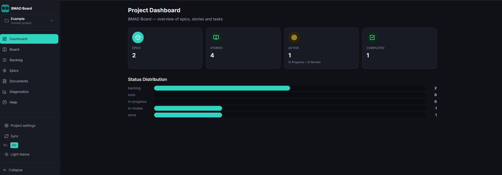
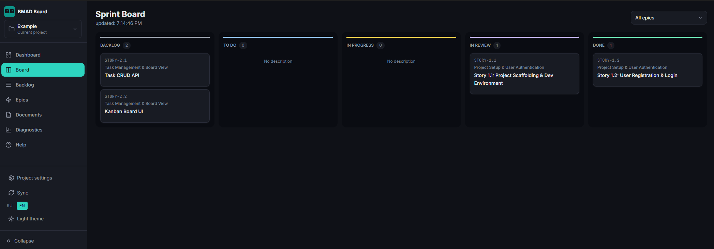
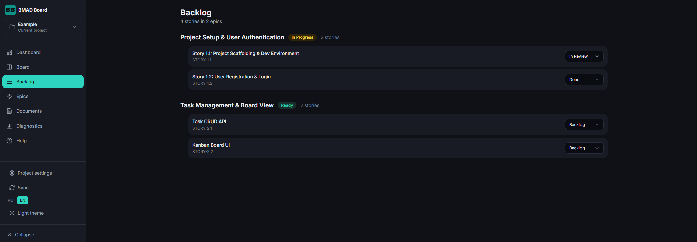
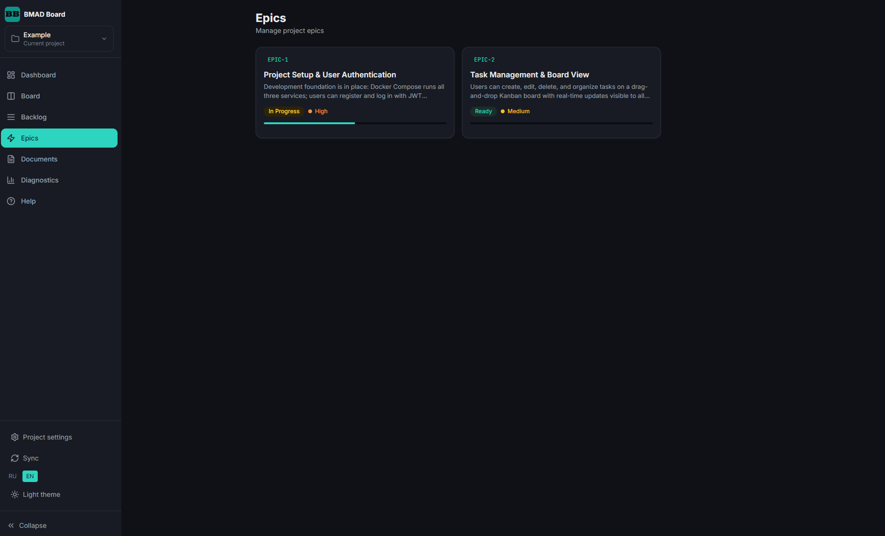
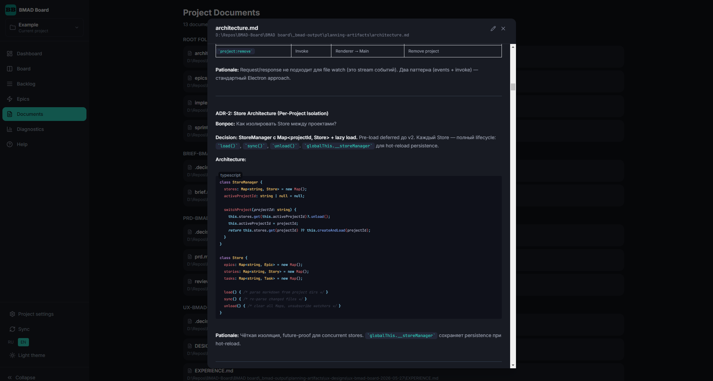
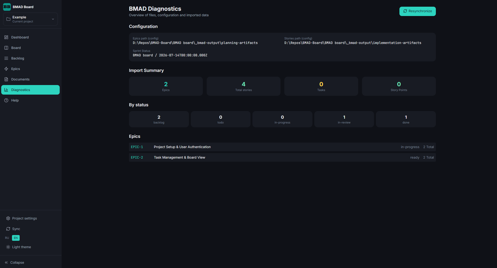

# BMAD Board

> A local Jira-like project management UI that reads directly from [BMAD Method](https://github.com/bmadcode/BMAD-METHOD) markdown artifacts.

## What is BMAD?

**BMAD (Build More Architect Dreams)** is an AI-driven agile development **framework** within the [BMad Method](https://docs.bmad-method.org) Module Ecosystem — the most comprehensive Agile AI-Driven Development framework with true scale-adaptive intelligence that adjusts from bug fixes to enterprise systems. At its core lies the **Spec-Driven Development** methodology — a structured approach where detailed specifications drive every stage of the development lifecycle. 100% free and open source.

Unlike traditional AI tools that do the thinking for you, BMad agents and facilitated workflows act as **expert collaborators** who guide you through a structured process — bringing out your best thinking in partnership with AI.

Key capabilities of the BMad Method:

- **Scale-Domain-Adaptive** — automatically adjusts planning depth based on project complexity
- **Structured Workflows** — grounded in agile best practices across analysis, planning, architecture, and implementation
- **Specialized Agents** — 12+ domain experts (PM, Architect, Developer, UX, Scrum Master, and more)
- **Party Mode** — bring multiple agent personas into one session to collaborate and discuss
- **Complete Lifecycle** — from brainstorming to deployment

All project artifacts — requirements, architecture, design, epics, stories, and sprint status — are kept as **plain markdown and YAML files** in a `_bmad-output/` folder inside your repository.

A typical BMAD workflow:

1. **Planning Phase** — Specialized AI agents generate planning artifacts: a Product Requirements Document (PRD), architecture overview, UX design specification, and an epics file that breaks the project into epics and stories.
2. **Implementation Phase** — For each story, a detailed implementation artifact is generated with tasks, acceptance criteria, API contracts, and technical notes. A `sprint-status.yaml` tracks progress.
3. **Development** — Developers work through stories using specialized BMAD skills, generating and reviewing code in partnership with AI agents. Progress is tracked via `sprint-status.yaml`, and all artifacts stay in version control alongside the code.

> Learn more at [docs.bmad-method.org](https://docs.bmad-method.org)

### BMAD Artifacts in This Repository

The `_bmad-output/` folder in this repo contains example BMAD artifacts for a sample "TaskFlow" project:

```
_bmad-output/
├── planning-artifacts/
│   ├── prd.md                     # Product Requirements Document
│   ├── architecture.md            # System architecture & ADRs
│   ├── ux-design-specification.md # UX flows & wireframes
│   └── epics.md                   # Epics with stories breakdown
└── implementation-artifacts/
    ├── 1-1-story-example.md       # Story 1.1 implementation spec
    ├── 1-2-story-example.md       # Story 1.2 implementation spec
    └── sprint-status.yaml         # Sprint progress tracker
```

**BMAD Board** is a companion tool that turns these flat files into an interactive project management UI — so you don't have to read raw markdown to track your project.

---

## Features

| Page             | Description                                                                          |
| ---------------- | ------------------------------------------------------------------------------------ |
| **Dashboard**    | Overview of epics, stories, progress bars, and story points                          |
| **Sprint Board** | Kanban columns (Backlog → To Do → In Progress → In Review → Done) with drag-and-drop |
| **Backlog**      | Full story list with filtering by epic, status, and priority                         |
| **Epics**        | Epic list with progress indicators and detail pages                                  |
| **Stories**      | Story detail view with tasks, acceptance criteria, and inline markdown editor        |
| **Documents**    | Browse and edit all planning artifacts (PRD, architecture, UX spec, etc.)            |
| **Diagnostics**  | File system and configuration health checks                                          |

Additional capabilities:

- **Markdown Editing** — edit any document, epic, or story in the browser; changes persist to disk
- **i18n** — English and Russian UI with a language switcher
- **Configuration API** — runtime-configurable paths to artifacts directories

---

## Screenshots

### Dashboard



### Sprint Board (Kanban)



### Backlog



### Epic Detail



### Document Viewer



### Diagnostics



---

## Installation

### Prerequisites

- **Node.js** 18+
- **npm** 9+
- A `_bmad-output/` folder with BMAD artifacts (this repo includes example artifacts)

### Quick Start

```bash
git clone https://github.com/mol4/BMAD-Board.git
cd BMAD-Board/BMAD\ board
npm install
npm run dev
```

Open [http://localhost:3333](http://localhost:3333) in your browser.

### Production Build

```bash
npm run build
npm run start
```

The app runs on **port 3333** by default.

---

## Usage

### Expected Folder Structure

```
your-project/
├── _bmad-output/
│   ├── planning-artifacts/       ← epics & planning docs
│   │   ├── epics.md              ← all epics in one file (## Epic N: Title)
│   │   ├── prd.md
│   │   ├── architecture.md
│   │   └── ...
│   └── implementation-artifacts/ ← stories & sprint status
│       ├── 1-1-some-story.md
│       ├── 1-2-another-story.md
│       ├── sprint-status.yaml
│       └── ...
└── BMAD board/                   ← this app (sibling folder)
    └── ...
```

BMAD Board expects to live **next to** `_bmad-output/` (one level up). Default paths:

| Setting       | Default                                    |
| ------------- | ------------------------------------------ |
| `epicsDir`    | `../_bmad-output/planning-artifacts`       |
| `storiesDir`  | `../_bmad-output/implementation-artifacts` |
| `storiesMode` | `flat` (auto-detected)                     |

These can be changed at runtime via `PATCH /api/config`.

### Stories Mode

| Mode       | Description                                                                                                                            |
| ---------- | -------------------------------------------------------------------------------------------------------------------------------------- |
| **flat**   | All stories in a single folder. Linked to epics by filename pattern (`1-2-story-name.md` → EPIC-1, STORY-1.2) or frontmatter `epicId`. |
| **nested** | Stories in subdirectories matching epic filenames (`epic-1/story-1.md`).                                                               |

The mode is auto-detected and can be overridden via the config API.

---

## API Endpoints

| Method  | Endpoint                     | Description               |
| ------- | ---------------------------- | ------------------------- |
| GET     | `/api/epics`                 | List all epics            |
| GET     | `/api/stories`               | List all stories          |
| GET     | `/api/tasks`                 | List all tasks            |
| GET     | `/api/docs`                  | List planning documents   |
| GET     | `/api/docs/[id]`             | Get document content      |
| PUT     | `/api/docs/[id]`             | Update document content   |
| GET/PUT | `/api/epics/[id]/markdown`   | Get/update epic markdown  |
| GET/PUT | `/api/stories/[id]/markdown` | Get/update story markdown |
| GET     | `/api/config`                | Current configuration     |
| PATCH   | `/api/config`                | Update configuration      |
| DELETE  | `/api/config`                | Reset to defaults         |
| POST    | `/api/sync`                  | Re-sync from filesystem   |
| GET     | `/api/diagnostics`           | File system diagnostics   |

---

## Tech Stack

- **Next.js 14** (App Router)
- **React 18** + TypeScript
- **Tailwind CSS** + `@tailwindcss/typography`
- **gray-matter** — frontmatter parsing
- **marked** — markdown rendering
- **js-yaml** — sprint-status.yaml parsing
